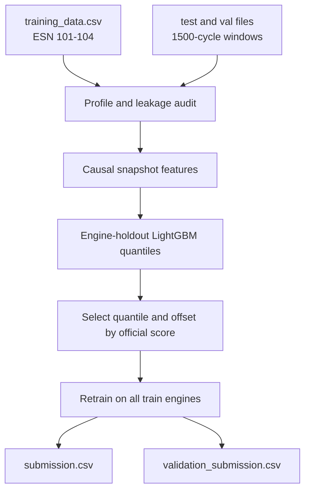

# PHM engine maintenance prediction

Leakage-safe remaining-cycle models for the [PHM North America 2025 engine data challenge](https://data.phmsociety.org/phm-north-america-2025-conference-data-challenge/).

Predict remaining cycles to:

- `Cycles_to_HPT_SV` — high-pressure turbine shop visit
- `Cycles_to_HPC_SV` — high-pressure compressor shop visit
- `Cycles_to_WW` — HPC water wash

Repository: [zico1992/PHM](https://github.com/zico1992/PHM)

## Results (engine holdout)

Lower official score is better (perfect = 0). Models are ranked by the challenge time-weighted error, not MAE.

| Method | Official score |
| --- | ---: |
| Median baseline | 117.15 |
| LightGBM quantile 0.30 + additive calibration | **26.44** |

| Target | Official score | MAE | Late rate | Early rate | Selected quantile | Offset (cycles) |
| --- | ---: | ---: | ---: | ---: | ---: | ---: |
| WW | 19.95 | 309 | 24% | 76% | 0.30 | −73 |
| HPC shop visit | 35.18 | 1,588 | 21% | 79% | 0.30 | −560 |
| HPT shop visit | 24.19 | 679 | 20% | 80% | 0.30 | −244 |

Validation is leave-one-engine-out on ESNs 101–104 (2,468 windows). Test and validation labels were not used.

## Pipeline



## Challenge submissions

| File | Rows |
| --- | ---: |
| [`submission.csv`](submission.csv) | 52 test files (`test_0` … `test_51`) |
| [`validation_submission.csv`](validation_submission.csv) | 48 validation files (`val_0` … `val_47`) |

Columns: `file`, `Cycles_to_HPT_SV`, `Cycles_to_HPC_SV`, `Cycles_to_WW`

## Reproduce

```powershell
python -m venv pm_venv
.\pm_venv\Scripts\python.exe -m pip install pandas numpy scikit-learn lightgbm
.\pm_venv\Scripts\python.exe -m src.predict
```

Artifacts:

- `reports/model_oof_metrics.json` — holdout scores
- `reports/leakage_audit.csv` — keep/exclude decisions
- `models/` — LightGBM boosters and freeze metadata

## Layout

```text
src/                 training, features, scorer, submission checks
training_data/       labeled engines 101-104
test_data/test/      unlabeled test windows
validation_data/val/ unlabeled validation windows
reports/             profiling, folds, OOF metrics
outputs/             copies of submission CSVs
SKILL.md             modeling skill used to build this pipeline
```
