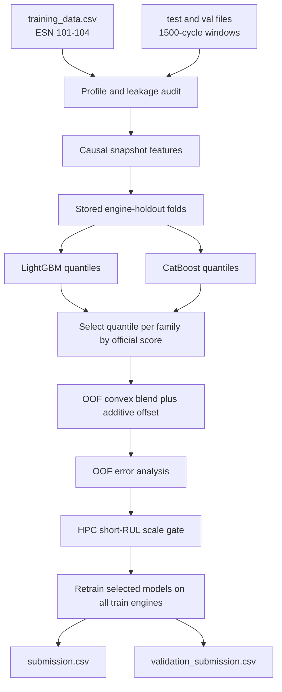

# PHM engine maintenance prediction

Leakage-safe remaining-cycle models for the [PHM North America 2025 engine data challenge](https://data.phmsociety.org/phm-north-america-2025-conference-data-challenge/).

Predict remaining cycles to:

- `Cycles_to_HPT_SV` — high-pressure turbine shop visit
- `Cycles_to_HPC_SV` — high-pressure compressor shop visit
- `Cycles_to_WW` — HPC water wash

Repository: [zico1992/PHM](https://github.com/zico1992/PHM) · branch [`ensemble-hpc-gate`](https://github.com/zico1992/PHM/tree/ensemble-hpc-gate)

## Results (engine holdout)

Lower official score is better (perfect = 0). Models are ranked by the challenge time-weighted error, not MAE. CatBoost used the same stored engine-holdout folds as LightGBM. Ensemble weights and the HPC gate were fit on OOF predictions only.

| Method | Official score |
| --- | ---: |
| Median baseline | 117.15 |
| CatBoost + additive calibration | 28.84 |
| LightGBM quantile 0.30 + additive calibration | 26.44 |
| OOF-weighted LightGBM + CatBoost ensemble | 25.67 |
| Ensemble + HPC short-RUL scale gate | **24.56** |

| Target | Score | LGB weight | CB weight | LGB q | CB q | Offset |
| --- | ---: | ---: | ---: | ---: | ---: | ---: |
| WW | 19.56 | 0.20 | 0.80 | 0.30 | 0.30 | −70 |
| HPC shop visit (pre-gate) | 35.18 | 1.00 | 0.00 | 0.30 | 0.35 | −560 |
| HPC shop visit (post-gate) | **31.85** | 1.00 | 0.00 | 0.30 | 0.35 | −560 + gate |
| HPT shop visit | 22.27 | 0.00 | 1.00 | 0.30 | 0.30 | −244 |

HPC kept LightGBM only because CatBoost was worse on the official score. HPT kept CatBoost only. WW is a 20/80 blend.

### HPC gate (what changed)

OOF error analysis showed HPC is the weak link, driven by **late near-event misses** (true RUL ≤ ~500 but predictions in the thousands), especially on ESN 104. The 0–500 RUL bucket alone carried a large share of the HPC score mass.

The gate:

1. Trains a leave-one-engine-out classifier for “short HPC RUL ≤ 500” from causal degradation features (T45/core-speed residuals, slopes, deltas).
2. When short-RUL probability ≥ threshold, **scales the HPC prediction down**.
3. Retunes a small additive post-offset on OOF only.

Production settings: `proba_threshold=0.03`, `scale_factor=0.55`, `post_offset≈+90` (nested LOEO holdout score **24.56**).

Lower HPC quantiles (0.15–0.25) were tried and **not selected** — after ensembling they did not beat the gated q0.30 recipe.

Validation is leave-one-engine-out on ESNs 101–104 (2,468 windows). Test and validation labels were not used.

## Pipeline



## Challenge submissions

| File | Rows |
| --- | ---: |
| [`submission.csv`](submission.csv) | 52 test files (`test_0` … `test_51`) |
| [`validation_submission.csv`](validation_submission.csv) | 48 validation files (`val_0` … `val_47`) |

Columns: `file`, `Cycles_to_HPT_SV`, `Cycles_to_HPC_SV`, `Cycles_to_WW`

## Reproduce

```powershell
python -m venv pm_venv
.\pm_venv\Scripts\python.exe -m pip install pandas numpy scikit-learn lightgbm catboost
.\pm_venv\Scripts\python.exe -m src.predict
```

`src.predict` runs the full path (features → OOF families → ensemble → nested HPC gate → final models → submissions).

To re-apply the gate on cached OOF / models only:

```powershell
.\pm_venv\Scripts\python.exe scripts\restore_gated_baseline.py
```

OOF error analysis:

```powershell
.\pm_venv\Scripts\python.exe scripts\oof_error_analysis.py
```

Artifacts:

- `reports/ensemble_oof_metrics.json` — holdout ensemble (+ gate) scores
- `reports/ensemble_pre_gate_oof_metrics.json` — pre-gate ensemble scores
- `reports/hpc_gate.json` — gate thresholds, scale, fold configs
- `reports/oof_error_analysis.json` — target / engine / RUL-bucket breakdown
- `reports/ensemble_weights.json` — OOF blend weights + gate payload
- `reports/engine_holdout_folds.csv` — reused folds
- `models/` — LightGBM, CatBoost, HPC gate classifier, metadata

## Layout

```text
src/                 training, features, scorer, ensemble, HPC gate, submission checks
scripts/             error analysis, gate restore / apply helpers
training_data/       labeled engines 101-104
test_data/test/      unlabeled test windows
validation_data/val/ unlabeled validation windows
reports/             profiling, folds, OOF metrics, gate config
outputs/             copies of submission CSVs
models/              frozen boosters + gate classifier
SKILL.md             modeling skill used to build this pipeline
```
